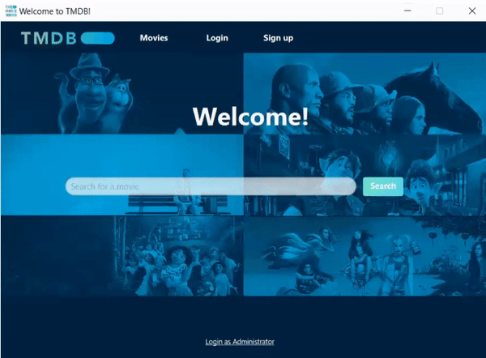

# Description of the project


:movie_camera: This is a simple application in Java that was implemented as a project for university coursework (*Software Construction Course*). Project was inspired by TMDB and IMDb.
This application contains important information about all movies and users that are in database.

* Users can sign up, log in, create watchlists and search for a specific movie. 
* Admins can add a new movie, delete movies, delete users and see all users and movies that are stored in database.


## How to run the App?

The most important command for running this app is:
```
mvn clean javafx:run
```
Other commands we used are:
```
mvn clean install
mvn javadoc:aggregate
```

## Functionality
* Search for a movie



* Log in and create watchlist


* List of all movies


* Log in as admin


